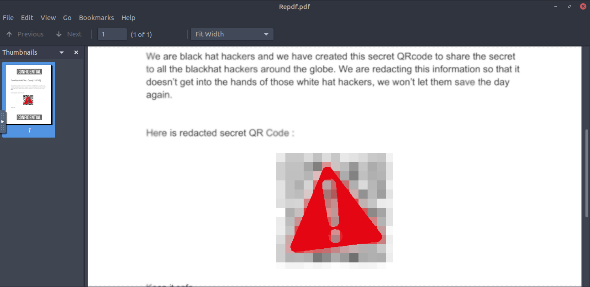
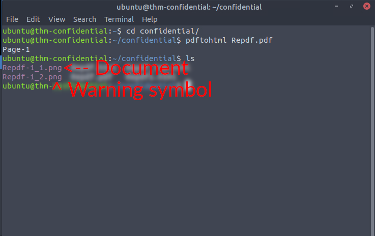
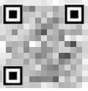
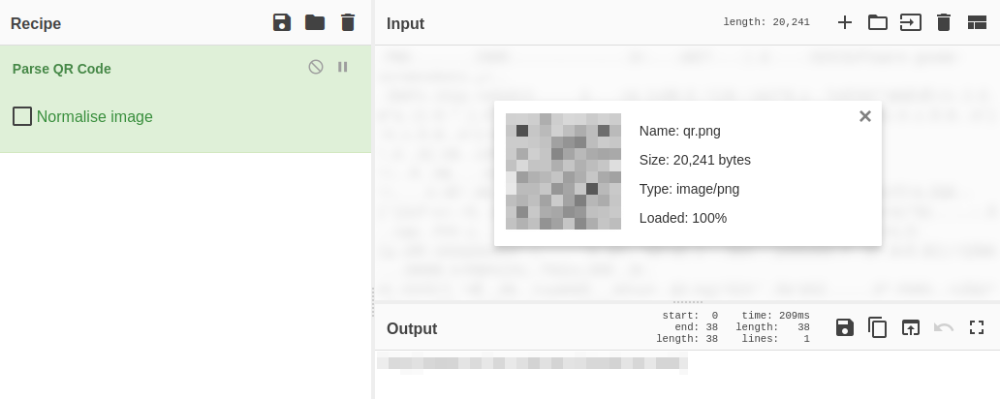

# Confidential
> TCN | Nov 13, 2022

## First glance
We open the document to find this

## Separation of PDF elements
After experimenting, we can separate the images using the `pdftohtml` command (there may be other ways, but this is one using the CLI that I found)

The first file (Repdf-1_1.png) is important. This is the entire document with the QR code visible entirely. The second file (Repdf-1_2.png) is the caution symbol, which was covering up the QR code.

---
## Decoding the QR code
Now, we extract the QR code (I did so by taking a screenshot of the QR code)

Then, we decode it (I used [CyberChef](http://gchq.github.io/CyberChef)'s `Parse QR Code` function)

## Room Complete!
Thanks for reading!