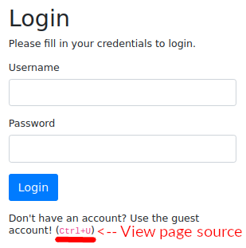
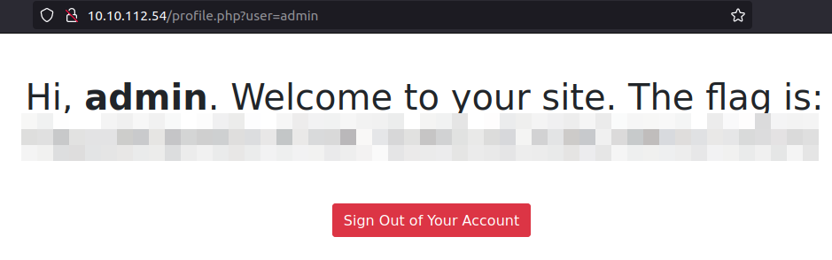

# Neighbour | TryHackMe
## TCN | Nov 12, 2022
---

## Visiting the site
When we visit the site, we are greeted with this login page:

From this login page, we can tell that guest credentials will be in the source code of the page (since Ctrl+U is the keyboard shortcut to open page source)

Upon opening the source code, we find this HTML comment on line 34:

---
## Signing in
Okay, so the user `"admin"` is off limits and we have the credentials for the `"guest"` user account `(guest:guest)`.

After logging in with those credentials, we see the page as below

We see the text `"Hi *guest*. Welcome to our site. Try not to peep your neighbor's profile"`. But let us have a look at the URL. `"http://MACHINE_IP/profile.php?user=guest"`

---
## Exploiting the vulnerability
There is a parameter `"user"` with the value `"guest"`. Perhaps this username is being inserted into the page text. Furthermore, will this parameter lead to insecure authentication and show something sensitive only accessible to certain accounts, e.g. admins? Well.. the answer is **YES**!

If we change this value from `"guest"` to `"admin"` (a username we found in the source code), we get access to the admin account and see the flag.

---
## Room Complete!

That ends the room.

[My Twitter @macnlinux_blog](http://twitter.com/macnlinux_blog)

[My Website](http://tercmd.com)

[My Newsletter](http://newsletter.tercmd.com)